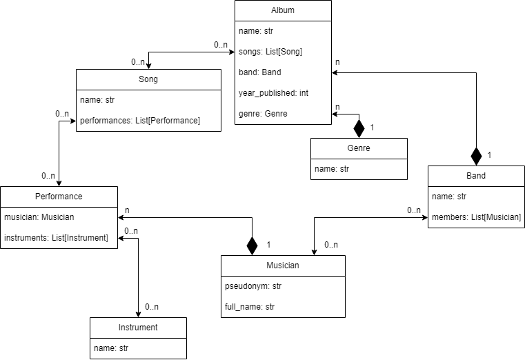

# "Rattle Music School"

Service for managing catalog of musicians, bands, albums, songs, instruments and genres.

## Link to website

[Music School project deployed to Render](https://music-school.onrender.com/)

Test user:
   - login: test
   - password: qazcde123

## Installation

Python3 must be already installed

```shell
git clone https://github.com/vlodek69/music-school
cd music-school
python3 -m venv venv
source venv/bin/activate
pip install -r requirements.txt
python manage.py runserver
```



## Page description

The user is redirected to the login page when trying to access any page on the site.

1. The home page has counters of how many musicians, bands and songs are present in the catalog. Underneath there is a counter of how many times the user visited the home page in the current session.
2. The All musicians page has a paginated list of all users with a search bar at the top (search by ether full name, username or pseudonym). User can click on the username in the list to open the musician detail page.
3. Musician detail page has:
   - User's full name & pseudonym;
   - List of instruments used in cataloged songs;
   - List of bands the user is a member of. Click on the band name to open the band page;
   - List of all songs the user has performed. The list has information about song name, band, album and instruments used by a chosen user. Above the list there is a filter that can be used to filter songs by instruments used by the user;
   - List of performances. Performances are unique sets of user and instruments used in creating song entries. On this page, user can create new performances, update or delete existing ones;
   - Buttons to update/delete user pages.
4. The All bands page has a paginated list of all bands in the catalog with a search bar on top (search by band name), click on the band's name to open the band detail page.
5. Band detail page has :
   - Buttons to update/delete band pages;
   - Band name;
   - List of band members, click on the member's name to open the musician detail page;
   - Paginated list of albums. Each album has a name, publish year, genre and list of songs, buttons to update/delete album;
   - Button to create a new album.
6. All songs page has a paginated list of all songs in the catalog. Use the search bar to filter songs by name or a filter by band. In the list click on the band's name to open the band detail page or on the song name for the song detail page.
7. Song detail page has:
   - Buttons to update/delete song pages;
   - Song's name;
   - Band's name;
   - List of albums the song is a part of;
   - List of performers (performer's name and instruments used).
8. The All instruments page shows a list of all instruments in the catalog, buttons to create a new instrument and update/delete each existing instrument.
9. The All genres page shows a list of all genres in the catalog, buttons to create a new genre and update/delete each existing genre.

## How to use

For example, if you need to catalog a new band with new musicians and songs:

1. Go to the All musicians page, press the "Create" button, fill and submit form. All fields but "pseudonym" field are required. Repeat for all musicians.
2. Go to the All bands page, press the "Create" button, enter band name, select members from the list and submit.
3. Go to the All songs page, press the "Create" button. Here you need to enter song's name and select performances. If there is no needed performance yet, you can create it using the "Create performance" form on this page: select musician and instruments and submit the form, the page will refresh. You can do the same for instruments. Optionally you can create performances on the musician detail page and instruments on the All instruments page. Repeat for all songs.
4. Open the band detail page (you can find it on the All bands page) and press the "Create album" button. Fill out and submit the form, you'll be redirected to the band detail page. If there is no suitable genre you can create it using the "Create genre" form at the bottom of the album create page or on the "All genres" page. Repeat for all albums.

## Additionally

1. One performance can be used in multiple songs.
2. One song can be listed in multiple albums and even different bands.
3. Musician does not necessarily have to be a member of the band to be listed as a performer in the band's song.
4. Performance in song can also use "instrument" like "teacher" or "writer" to reflect the role in the song.

## Demo

